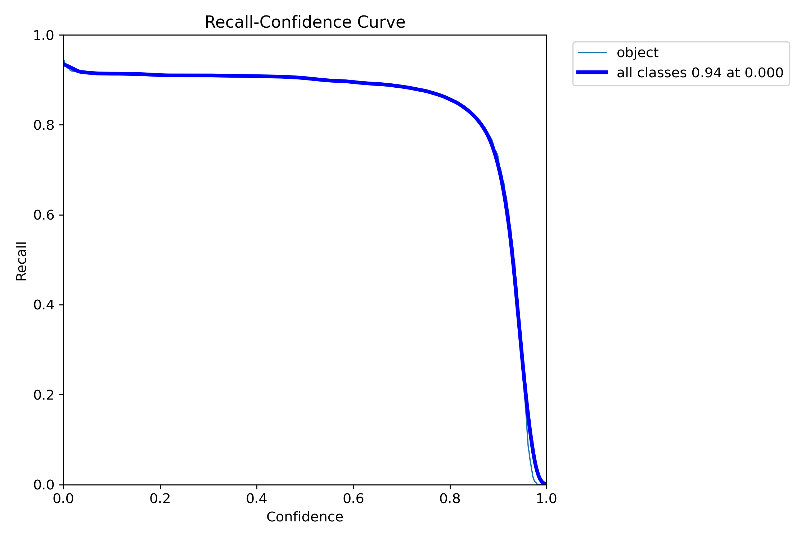

# Aplicación Web de Escaneo de Documentos con Técnicas de Visión por Computador


## Índice

- [Aplicación Web de Escaneo de Documentos con Técnicas de Visión por Computador](#aplicación-web-de-escaneo-de-documentos-con-técnicas-de-visión-por-computador)
  - [Índice](#índice)
  - [Autores](#autores)
  - [Motivación y Argumentación](#motivación-y-argumentación)
  - [Objetivo de la Propuesta](#objetivo-de-la-propuesta)
    - [Objetivo Principal](#objetivo-principal)
    - [Objetivos Específicos](#objetivos-específicos)
  - [Descripción Técnica](#descripción-técnica)
    - [Arquitectura del Sistema](#arquitectura-del-sistema)
    - [Tecnologías Implementadas](#tecnologías-implementadas)
  - [Fuentes y Tecnologías Utilizadas](#fuentes-y-tecnologías-utilizadas)
    - [Software](#software)
    - [Hardware](#hardware)
    - [Bibliotecas y Dependencias](#bibliotecas-y-dependencias)
  - [Resultados](#resultados)
    - [Entrenamiento del Modelo](#entrenamiento-del-modelo)
    - [Resultados del Entrenamiento](#resultados-del-entrenamiento)
    - [Ejemplo de Inferencia](#ejemplo-de-inferencia)
  - [Conclusiones y Propuestas de Ampliación](#conclusiones-y-propuestas-de-ampliación)
    - [Conclusiones](#conclusiones)
    - [Propuestas de Ampliación](#propuestas-de-ampliación)
  - [Herramientas Deseadas](#herramientas-deseadas)
  - [Enlaces](#enlaces)
  - [Créditos](#créditos)
  - [Anexos](#anexos)
    - [Diario de Reuniones](#diario-de-reuniones)

## Autores

- Marcos Vázquez Tascón
- Francisco Javier López-Dufour Morales

## Motivación y Argumentación

El proyecto surge como respuesta a una necesidad real identificada en el sector del transporte: la mejora en la calidad de las fotografías de documentos tomadas por conductores. En la actualidad, muchas empresas de transporte requieren que sus conductores documenten diversos papeles durante sus rutas, pero la calidad de estas capturas suele ser deficiente debido a condiciones variables de iluminación, ángulos inadecuados y otros factores ambientales.

La solución propuesta busca simplificar y optimizar este proceso mediante una aplicación web accesible, que implementa técnicas avanzadas de visión por computador para mejorar automáticamente la calidad de las imágenes capturadas.

## Objetivo de la Propuesta

### Objetivo Principal

Desarrollar una aplicación web que permita el escaneo y procesamiento automático de documentos utilizando técnicas de visión por computador, mejorando significativamente la calidad de las imágenes capturadas.

### Objetivos Específicos

- Implementar un sistema de detección automática de documentos utilizando modelos YOLO
- Desarrollar algoritmos de corrección de perspectiva y mejora de imagen
- Integrar capacidades de OCR para la extracción de texto
- Crear una interfaz web intuitiva y accesible
- Asegurar el funcionamiento completo en el navegador sin necesidad de procesamiento en servidor

## Descripción Técnica

### Arquitectura del Sistema

El proyecto se estructura en tres componentes principales:

1. **Módulo de Mejora de Imágenes**

   - Implementado con OpenCV.js
   - Incluye detección de contornos y corrección de perspectiva
   - Procesamiento de imagen para optimizar la calidad

2. **Sistema de Detección de Documentos**

   - Basado en YOLO y TensorFlow.js
   - Modelo entrenado con dataset específico de documentos
   - Adaptación para funcionamiento en navegador

   Durante el proceso de exportación del modelo YOLOv11n a TensorFlow.js, nos encontramos con un desafío técnico interesante: la diferencia en el formato de salida entre la inferencia en `Python` y `JavaScript`. Mientras que en `Python` (usando Ultralytics) el modelo devuelve directamente las coordenadas de los bounding boxes procesadas, en `TensorFlow.js` el modelo exportado produce un tensor con forma `[1, 5, 8400]`. Este tensor representa:

   - 8400 posibles detecciones
   - 5 canales de información por cada detección (x, y, ancho, alto, confianza)

   Esta diferencia se debe a que TensorFlow.js prioriza la eficiencia y flexibilidad, permitiendo que el post-procesamiento se realice en el lado del cliente según las necesidades específicas de la aplicación. Esta decisión de diseño nos llevó buscar una solución que implemente esta capa adicional de procesamiento en `JavaScript` para interpretar y visualizar las detecciones correctamente.

   Para la exportación del modelo a TensorFlow.js utilizamos el siguiente código:

   ```python
   from ultralytics import YOLO

   # Load the YOLO11 model
   model = YOLO("/content/detect/docuvision/weights/best.pt")

   # Export the model to TF.js format
   model.export(format="tfjs", simplify=True)  # creates '/best_web_model'
   ```

3. **Motor de OCR**
   - Integración de Tesseract.js
   - Capacidades de extracción de texto
   - Optimización para documentos procesados

### Tecnologías Implementadas

- `OpenCV.js` para procesamiento de imágenes
- `TensorFlow.js` para la ejecución del modelo YOLO
- `Tesseract.js` para OCR
- `JavaScript/HTML5` para la interfaz web

## Fuentes y Tecnologías Utilizadas

### Software

- [Software 1]
- [Software 2]

### Hardware

- [Hardware/Sensores utilizados]

### Bibliotecas y Dependencias

- [Biblioteca 1]
- [Biblioteca 2]

## Resultados

### Entrenamiento del Modelo

El entrenamiento del modelo se realizó utilizando YOLOv8n como base, con los siguientes parámetros:

- 100 épocas de entrenamiento
- Tamaño de imagen: 640x640
- Dataset: Four Corners Detection

Especificaciones del dataset:

- Resolución de imágenes: 640x640 píxeles
- Canales: 3 (RGB)
- Tipo de datos: uint8
- Tamaño medio por imagen: ~118KB

El proceso de exportación del modelo a TensorFlow.js requirió consideraciones especiales para su uso en el navegador. El modelo exportado produce tensores que requieren post-procesamiento adicional para convertir las predicciones en coordenadas utilizables. Esta característica, aunque inicialmente desafiante, nos permitió optimizar el rendimiento y personalizar el procesamiento según las necesidades específicas de nuestra aplicación web.

```python
from ultralytics import YOLO

model = YOLO("/content/drive/MyDrive/yolo11n.pt")

train_results = model.train(
    data="data.yaml",
    epochs=100,
    imgsz=640,
    name='docuvision'
)

metrics = model.val()
```

Los resultados de la validación del modelo muestran un muy buen rendimiento:

```
                 Class     Images  Instances      Box(P          R      mAP50  mAP50-95)
                   all        747       1021      0.936      0.897      0.921      0.862
```

El modelo fue evaluado sobre un conjunto de validación de 747 imágenes que contenían 1021 instancias de documentos, obteniendo métricas muy robustas:

- Precisión (P): 0.936 - Indica que el 93.6% de las detecciones realizadas son correctas
- Recall (R): 0.897 - El modelo es capaz de detectar el 89.7% de todos los documentos presentes
- mAP50: 0.921 - La precisión media con un IoU (Intersection over Union) del 50% es del 92.1%
- mAP50-95: 0.862 - La precisión media sobre múltiples umbrales de IoU es del 86.2%, lo que indica que el modelo es muy preciso en la mayoría de las detecciones.

Estos resultados demuestran que el modelo es altamente preciso en la detección de documentos, con un equilibrio óptimo entre precisión y recall.

### Resultados del Entrenamiento

Las siguientes gráficas muestran las métricas de rendimiento obtenidas durante el entrenamiento:

| Curva F1                                    | Curva de Precisión                                   |
| ------------------------------------------- | ---------------------------------------------------- |
|  |  |
| **Curva PR**                                | **Curva de Recall**                                  |
|  |     |

### Ejemplo de Inferencia


## Conclusiones y Propuestas de Ampliación

### Conclusiones

[Describir las conclusiones del proyecto]

### Propuestas de Ampliación

[Listar posibles mejoras o ampliaciones futuras]

## Herramientas Deseadas

[Indicar aquí las herramientas/tecnologías con las que les hubiera gustado contar]

## Enlaces

- [Enlace al código fuente](url_repositorio) ==TODO==
- [Vídeo de demostración](url_video) ==TODO==
- [Dataset de entrenamiento](https://universe.roboflow.com/tmayolov8/four-corners-detection)
- [Documentación oficial de Ultralytics sobre exportación de modelos](https://docs.ultralytics.com/modes/export/)
- [Discusión sobre diferencias en pre/post-procesamiento de YOLOv8](https://github.com/ultralytics/ultralytics/issues/2451)
- [Análisis del post-procesamiento en TensorFlow.js](https://github.com/ultralytics/ultralytics/issues/13413)

## Créditos

- Dataset "Four Corners Detection" de Roboflow, utilizado para el entrenamiento del modelo de detección de documentos (material no original del grupo)

## Anexos

### Diario de Reuniones

[Incluir aquí el diario de reuniones del grupo o enlazar al archivo específico]

---

_Proyecto desarrollado para la asignatura de Visión por Computador_
